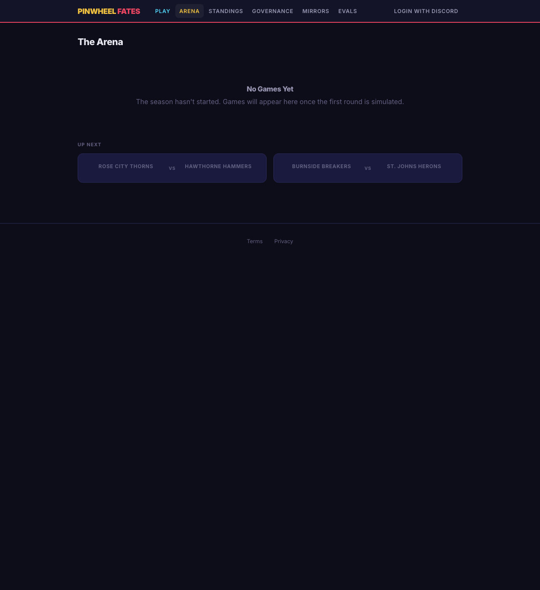
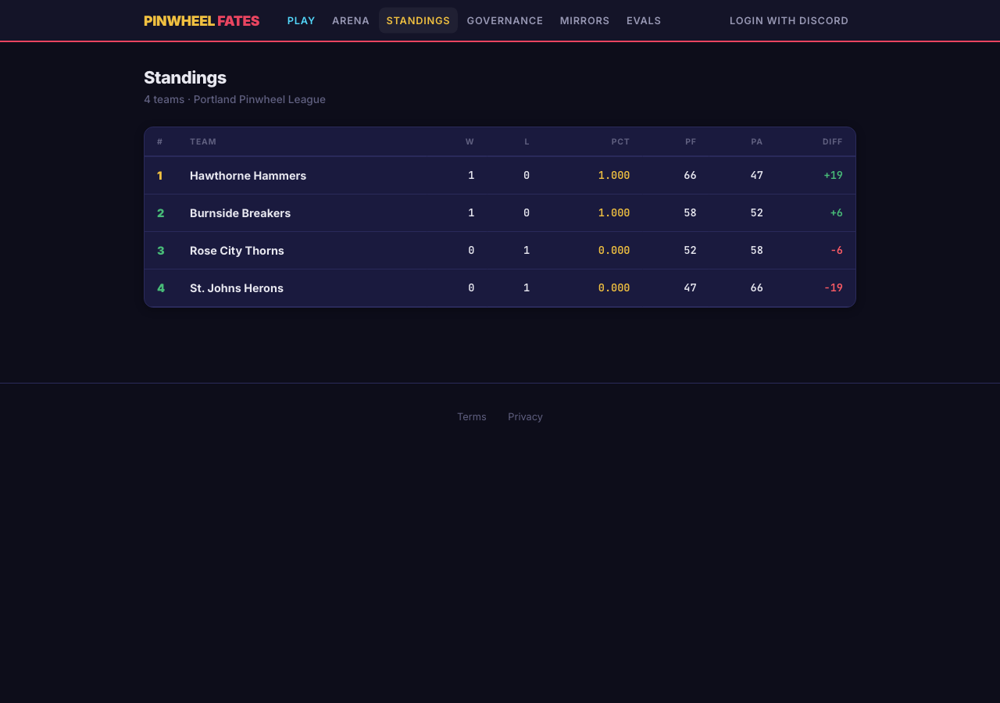
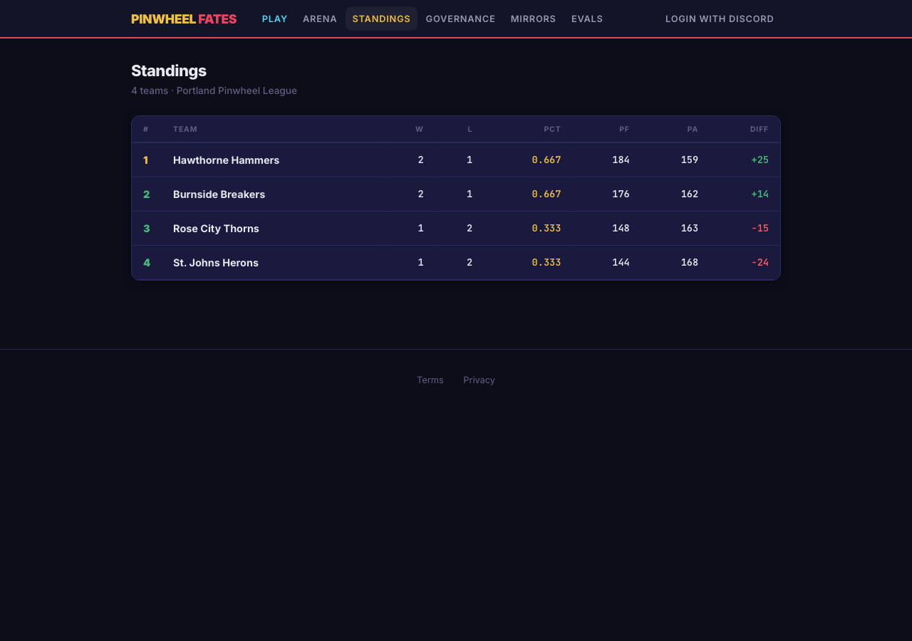
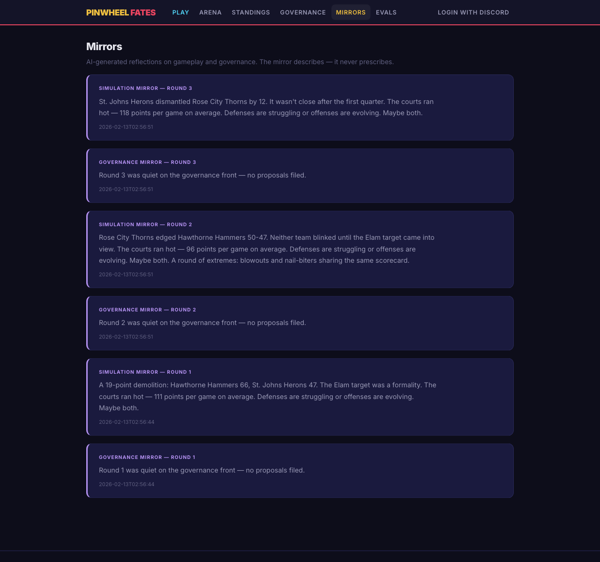
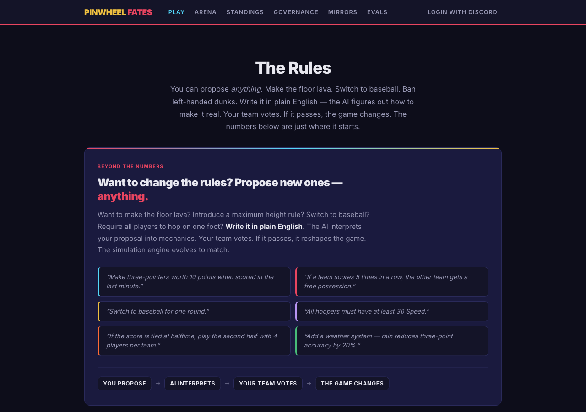
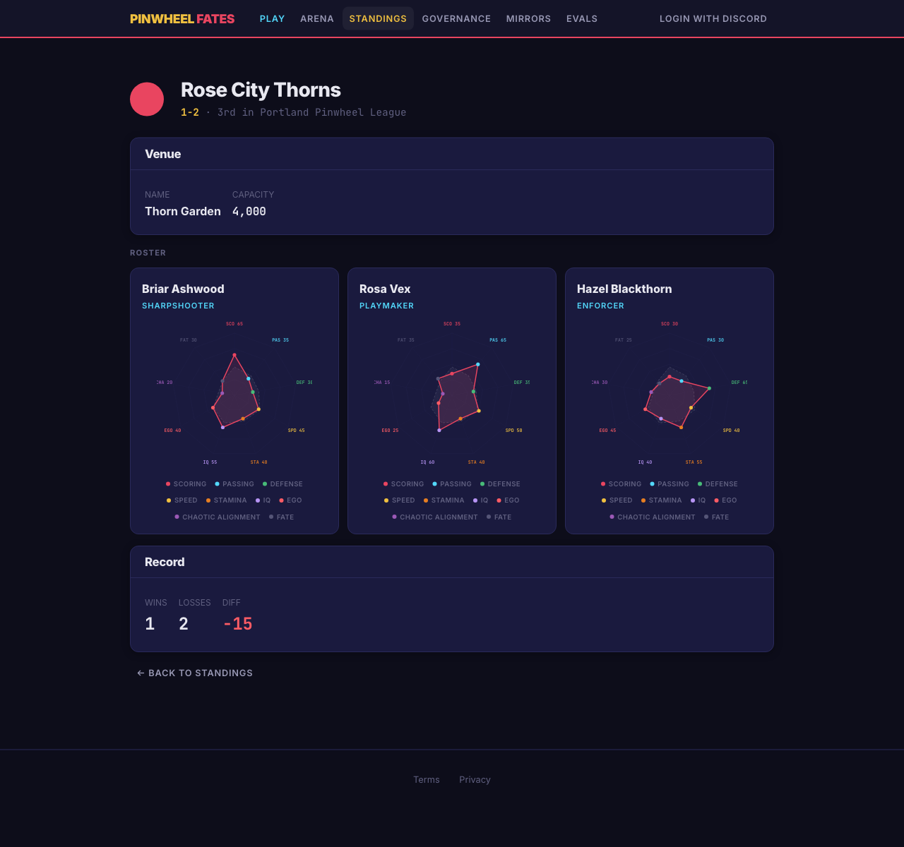

# Pinwheel Fates -- Full Cycle Demo

*2026-02-13T02:56:37Z*

**Pinwheel Fates** is a simulated 3v3 basketball league with human-driven, AI-interpreted governance and rules. Starts out as basketball, finishes as ???. The AI serves as a social mirror -- surfacing patterns in gameplay and governance that players cannot see from inside the system.

This document proves the full **Govern > Simulate > Observe > Reflect** cycle works end-to-end. Every command below was executed live; every screenshot was captured from the running application.

## Step 1: Seed the League

Create 4 Portland-themed teams with 3 agents each and generate a round-robin schedule.

```bash
uv run python scripts/demo_seed.py seed
```

```output
League seeded: 4 teams, 6 scheduled games
Season ID: 8f46f04a-f79c-4b04-ab9e-2f7ae43f7d7e
  Rose City Thorns: 114c47e5-4b06-46ba-ac69-e9eafa6c6df9
  Burnside Breakers: 2b59703e-a13e-4347-9595-0e24df126128
  St. Johns Herons: 92e7c601-5c4d-4f50-8118-98db804a2751
  Hawthorne Hammers: e861bb86-c757-4232-bf0e-9f141b2ccef2
```

## Step 2: Start the Web Dashboard

Launch the FastAPI server. The dashboard renders with HTMX + Jinja2 -- no JS build step.

```bash
curl -s http://localhost:8765/health | python3 -m json.tool
```

```output
{
    "status": "ok",
    "env": "development"
}
```

## Step 3: The Dashboard

The home page with navigation cards. Dark theme, retro sports broadcast aesthetic.

```bash {image}
uvx rodney screenshot demo/01_home.png -w 1280 -h 900
```


## Step 4: Simulate Round 1

Run the first round of games. The simulation engine resolves every possession probabilistically based on agent attributes and the current ruleset.

```bash
uv run python scripts/demo_seed.py step 1
```

```output
Round 1: 2 games, 2 mirrors
  Rose City Thorns 52 - 58 Burnside Breakers (AWAY) [ELAM]
  St. Johns Herons 47 - 66 Hawthorne Hammers (AWAY) [ELAM]
  Mirror (simulation): A 19-point demolition: Hawthorne Hammers 66, St. Johns Herons 47. The Elam targe...
  Mirror (governance): Round 1 was quiet on the governance front — no proposals filed....
```

## Step 5: The Arena

Game results appear in the Arena across multiple rounds with vivid Elam banner narration and per-round simulation mirrors. Each game panel shows the final score, possession count, and Elam Ending status.

```bash {image}
uvx rodney screenshot demo/02_arena.png -w 1280 -h 1400
```



## Step 6: Standings

The league table updates after each round. Win/Loss, Points For/Against, Differential.

```bash {image}
uvx rodney screenshot demo/03_standings.png -w 1280 -h 900
```



## Step 7: Game Detail

Click into a game for box scores and rich narrated play-by-play with player names and defenders. Every possession is recorded.

```bash {image}
uvx rodney screenshot demo/04_game_detail.png -w 1280 -h 1200
```


## Step 8: Advance the Season

Run 2 more rounds to build up standings and mirror data.

```bash
uv run python scripts/demo_seed.py step 2
```

```output
Round 2: 2 games, 2 mirrors
  Rose City Thorns 50 - 47 Hawthorne Hammers (HOME) [ELAM]
  Burnside Breakers 56 - 39 St. Johns Herons (HOME) [ELAM]
  Mirror (simulation): Rose City Thorns edged Hawthorne Hammers 50-47. Neither team blinked until the E...
  Mirror (governance): Round 2 was quiet on the governance front — no proposals filed....
Round 3: 2 games, 2 mirrors
  Rose City Thorns 46 - 58 St. Johns Herons (AWAY) [ELAM]
  Hawthorne Hammers 71 - 62 Burnside Breakers (HOME) [ELAM]
  Mirror (simulation): St. Johns Herons dismantled Rose City Thorns by 12. It wasn't close after the fi...
  Mirror (governance): Round 3 was quiet on the governance front — no proposals filed....
```

## Step 9: Standings After 3 Rounds

```bash
uv run python scripts/demo_seed.py status
```

```output
Season: Season 1 | Rounds played: 3
Team                        W   L    PCT    PF    PA  DIFF
-------------------------------------------------------
Hawthorne Hammers           2   1  0.667   184   159 +  25
Burnside Breakers           2   1  0.667   176   162 +  14
Rose City Thorns            1   2  0.333   148   163  -15
St. Johns Herons            1   2  0.333   144   168  -24
```

```bash {image}
uvx rodney screenshot demo/05_standings_r3.png -w 1280 -h 900
```



## Step 10: AI Mirrors

Narrative mirrors that reference specific teams and game details. The mirror system reflects on gameplay and governance. AI-generated observations describe patterns -- they never prescribe actions.

```bash {image}
uvx rodney screenshot demo/06_mirrors.png -w 1280 -h 1200
```



## Step 11: Governance -- Submit a Proposal

A governor proposes a rule change in natural language. The AI interprets it into structured parameters.

```bash
uv run python scripts/demo_seed.py propose Make three-pointers worth 5 points
```

```output
Proposal submitted: p-924935f4
  Text: Make three-pointers worth 5 points
```

```bash {image}
uvx rodney screenshot demo/07_governance.png -w 1280 -h 900
```


## Step 12: Current Ruleset

The rules page shows all current parameters and highlights changes from defaults.

```bash {image}
uvx rodney screenshot demo/08_rules.png -w 1280 -h 900
```



## Step 13: Team Profile

Each team has a profile with roster, agent attributes (visualized as bars), and venue info.

```bash {image}
uvx rodney screenshot demo/09_team.png -w 1280 -h 1200
```



## Step 14: Evals Dashboard

The admin-facing evals dashboard shows aggregate mirror quality metrics, scenario flags, and AI rule evaluation. No individual mirror text is ever displayed -- only counts, rates, and composite scores.
