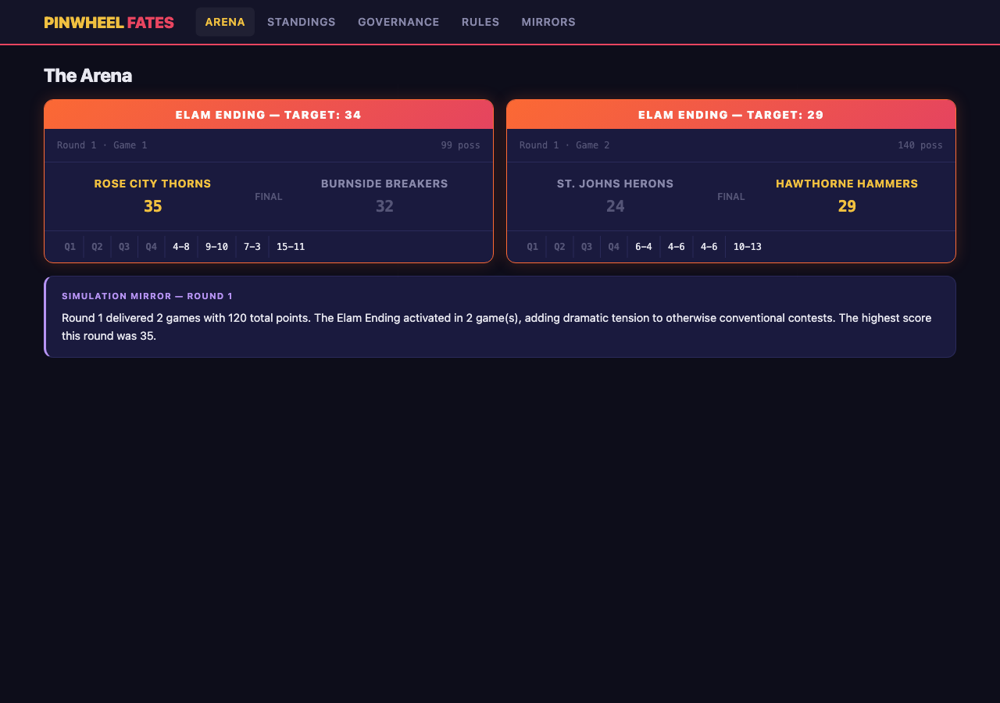
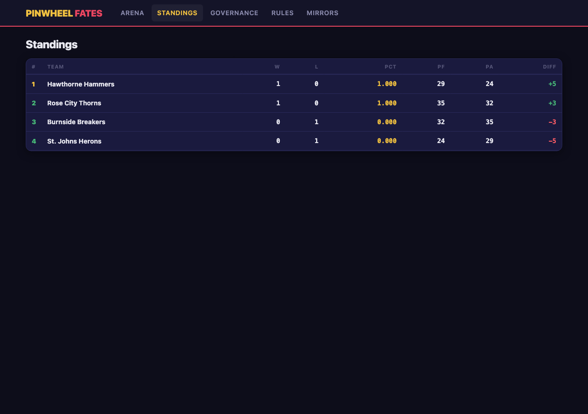
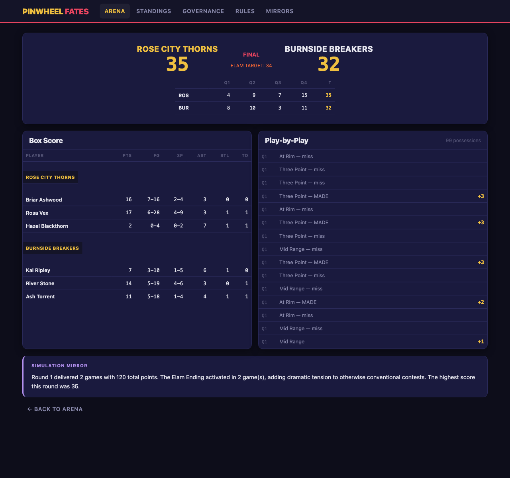
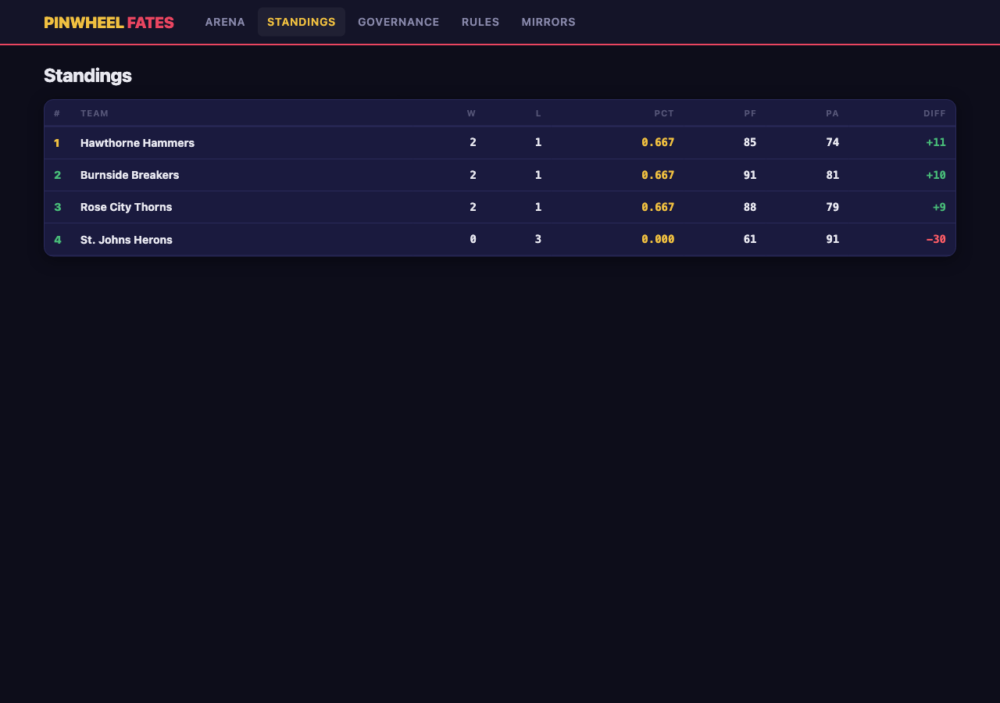
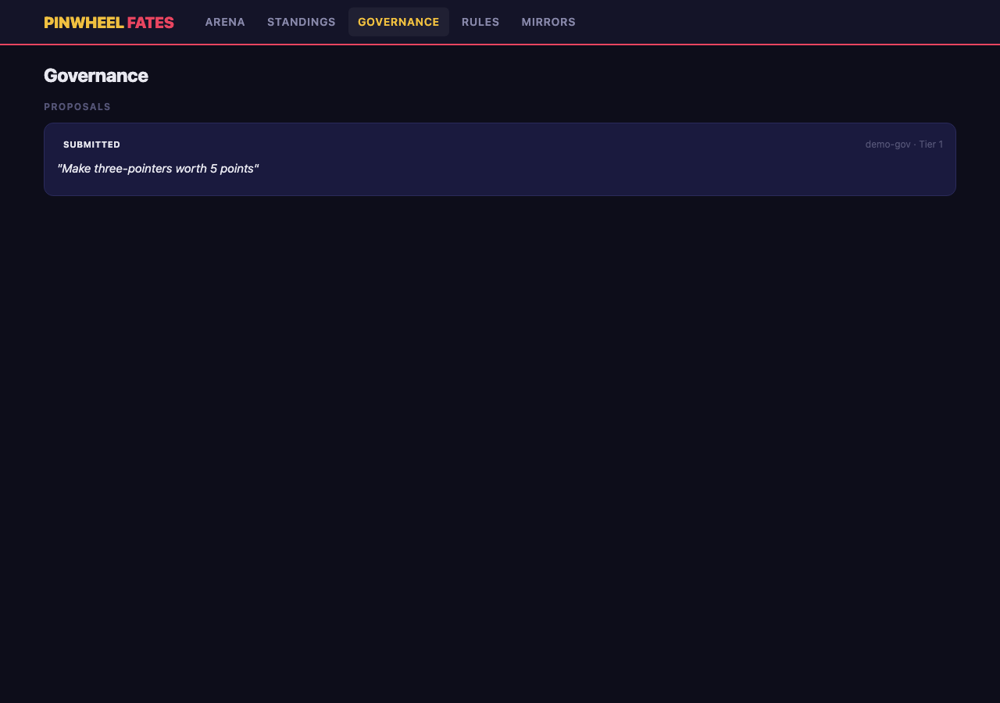
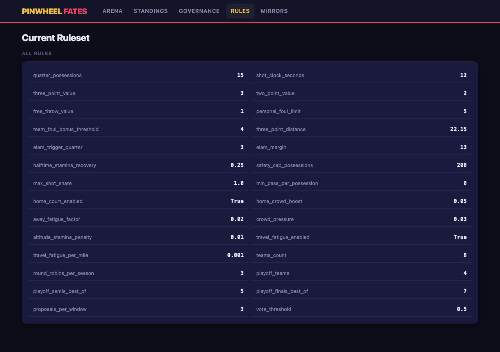

# Pinwheel Fates -- Full Cycle Demo

*2026-02-11T23:40:17Z*

**Pinwheel Fates** is a Blaseball-inspired auto-simulated 3v3 basketball league where human players govern the rules through AI-interpreted natural language proposals. The AI serves as a social mirror -- surfacing patterns in gameplay and governance that players cannot see from inside the system.

This document proves the full **Govern > Simulate > Observe > Reflect** cycle works end-to-end. Every command below was executed live; every screenshot was captured from the running application.

## Step 1: Seed the League

Create 4 Portland-themed teams with 3 agents each and generate a round-robin schedule.

```bash
.venv/bin/python scripts/demo_seed.py seed
```

```output
League seeded: 4 teams, 6 scheduled games
Season ID: fa08edc7-1d2f-4771-96e9-f7d8d5f73328
  Rose City Thorns: d37e2832-193f-4109-b3f6-7b140139abf9
  Burnside Breakers: f4d4c61e-8047-4d77-9887-aa3f0e311a2c
  St. Johns Herons: eefef930-a210-41d0-b052-fbdbefe4fc8a
  Hawthorne Hammers: ab38992f-a3d8-4ed3-a875-402f61b9b130
```

## Step 2: Start the Web Dashboard

Launch the FastAPI server. The dashboard renders with HTMX + Jinja2 -- no JS build step.

```bash
curl -s http://localhost:8765/health | python3 -m json.tool
```

```output
{
    "status": "ok",
    "env": "development"
}
```

## Step 3: The Dashboard

The home page with navigation cards. Dark theme, Blaseball-inspired aesthetic.

```bash {image}
uvx rodney screenshot demo/01_home.png -w 1280 -h 900
```


## Step 4: Simulate Round 1

Run the first round of games. The simulation engine resolves every possession probabilistically based on agent attributes and the current ruleset.

```bash
.venv/bin/python scripts/demo_seed.py step 1
```

```output
Round 1: 2 games, 2 mirrors
  Rose City Thorns 35 - 32 Burnside Breakers (AWAY) [ELAM]
  St. Johns Herons 24 - 29 Hawthorne Hammers (AWAY) [ELAM]
  Mirror (simulation): Round 1 delivered 2 games with 120 total points. The Elam Ending activated in 2 ...
  Mirror (governance): Round 1 was quiet on the governance front — no proposals filed....
```

## Step 5: The Arena

Game results appear in the Arena. Each game panel shows the final score, possession count, and Elam Ending status.

```bash {image}
uvx rodney screenshot demo/02_arena.png -w 1280 -h 900
```



## Step 6: Standings

The league table updates after each round. Win/Loss, Points For/Against, Differential.

```bash {image}
uvx rodney screenshot demo/03_standings.png -w 1280 -h 900
```



## Step 7: Game Detail

Click into a game for box scores and play-by-play. Every possession is recorded.

```bash {image}
uvx rodney screenshot demo/04_game_detail.png -w 1280 -h 1200
```



## Step 8: Advance the Season

Run 2 more rounds to build up standings and mirror data.

```bash
.venv/bin/python scripts/demo_seed.py step 2
```

```output
Round 2: 2 games, 2 mirrors
  Rose City Thorns 21 - 32 Hawthorne Hammers (AWAY) [ELAM]
  Burnside Breakers 30 - 22 St. Johns Herons (AWAY) [ELAM]
  Mirror (simulation): Round 2 delivered 2 games with 105 total points. The Elam Ending activated in 2 ...
  Mirror (governance): Round 2 was quiet on the governance front — no proposals filed....
Round 3: 2 games, 2 mirrors
  Rose City Thorns 32 - 15 St. Johns Herons (AWAY) [ELAM]
  Hawthorne Hammers 24 - 29 Burnside Breakers (AWAY) [ELAM]
  Mirror (simulation): Round 3 delivered 2 games with 100 total points. The Elam Ending activated in 2 ...
  Mirror (governance): Round 3 was quiet on the governance front — no proposals filed....
```

## Step 9: Standings After 3 Rounds

```bash
.venv/bin/python scripts/demo_seed.py status
```

```output
Season: Season 1 | Rounds played: 3
Team                        W   L    PCT    PF    PA  DIFF
-------------------------------------------------------
Hawthorne Hammers           2   1  0.667    85    74 +  11
Burnside Breakers           2   1  0.667    91    81 +  10
Rose City Thorns            2   1  0.667    88    79 +   9
St. Johns Herons            0   3  0.000    61    91  -30
```

```bash {image}
uvx rodney screenshot demo/05_standings_r3.png -w 1280 -h 900
```



## Step 10: AI Mirrors

The mirror system reflects on gameplay and governance. AI-generated observations describe patterns -- they never prescribe actions.

```bash {image}
uvx rodney screenshot demo/06_mirrors.png -w 1280 -h 1200
```


## Step 11: Governance -- Submit a Proposal

A governor proposes a rule change in natural language. The AI interprets it into structured parameters.

```bash
.venv/bin/python scripts/demo_seed.py propose Make three-pointers worth 5 points
```

```output
Proposal submitted: p-a4a87373
  Text: Make three-pointers worth 5 points
```

```bash {image}
uvx rodney screenshot demo/07_governance.png -w 1280 -h 900
```



## Step 12: Current Ruleset

The rules page shows all current parameters and highlights changes from defaults.

```bash {image}
uvx rodney screenshot demo/08_rules.png -w 1280 -h 900
```



## Step 13: Team Profile

Each team has a profile with roster, agent attributes (visualized as bars), and venue info.

```bash {image}
uvx rodney screenshot demo/09_team.png -w 1280 -h 1200
```


## Verification

All 240 tests pass. Zero lint errors. The demo above was captured live from a running instance.

```bash
.venv/bin/python -m pytest --tb=short -q 2>&1 | tail -3
```

```output
........................................................................ [ 90%]
........................                                                 [100%]
240 passed in 29.51s
```
