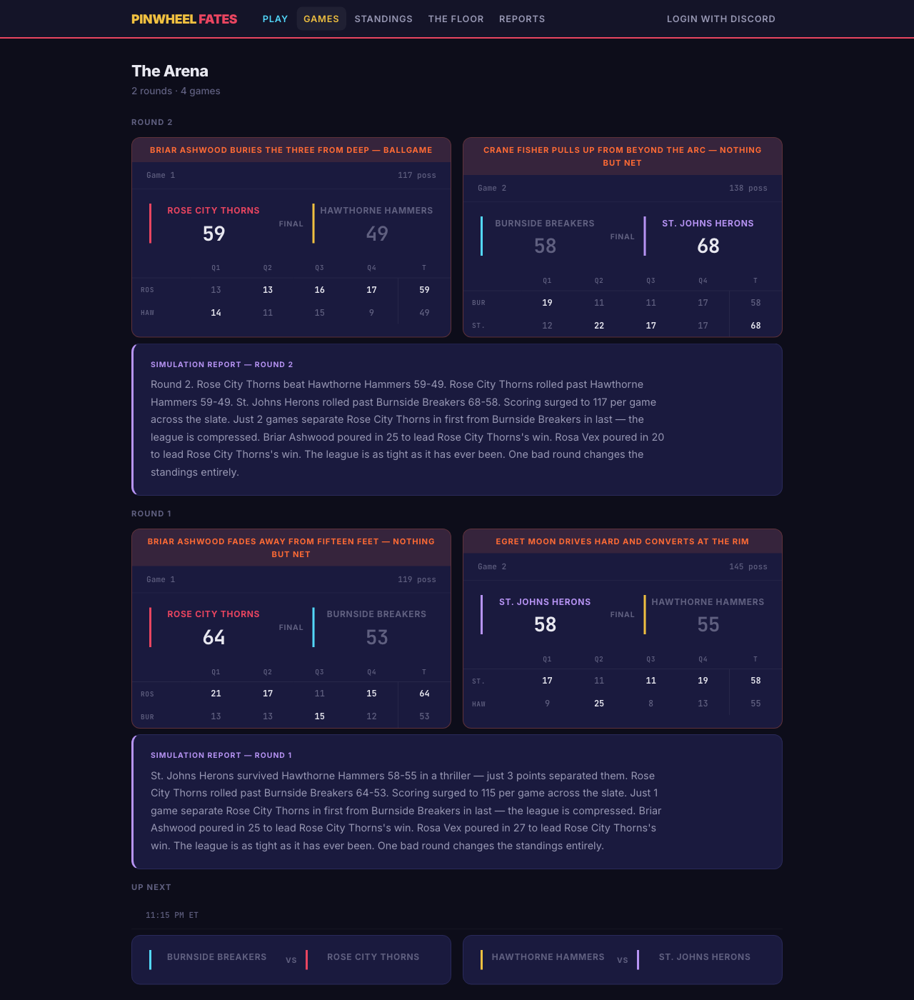
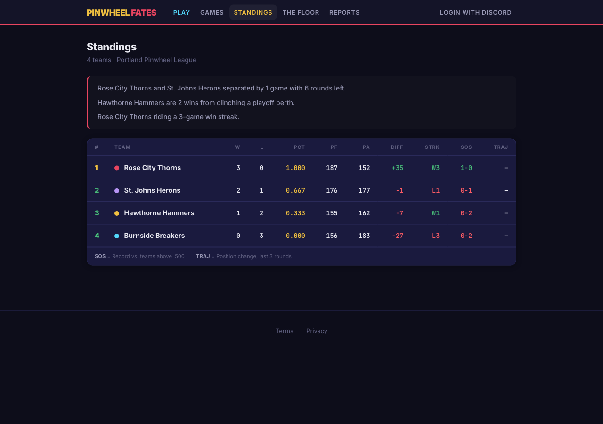
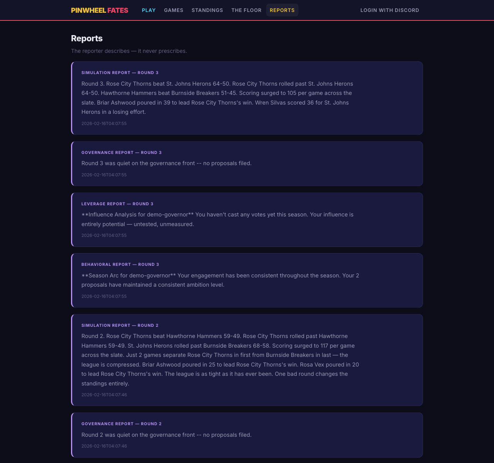
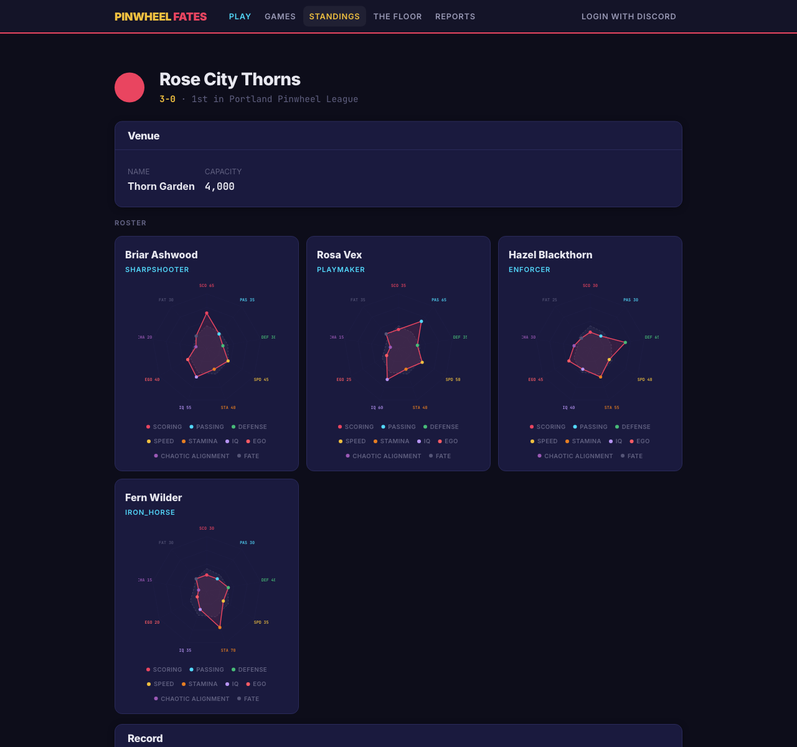
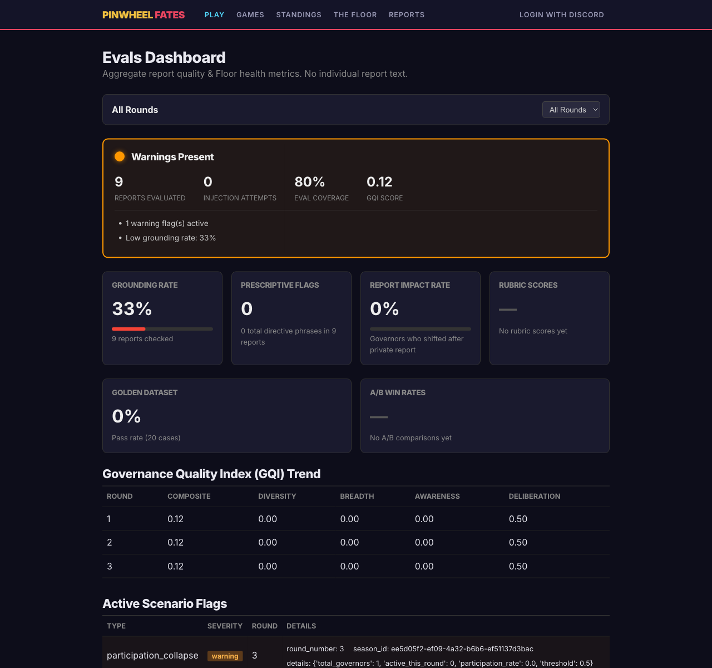

# Pinwheel Fates -- Video Demo Storyboard

*2026-02-16T04:07:45Z by Showboat 0.5.0*

Visual storyboard for the 3-minute hackathon video. Each section maps to a beat in `docs/DEMO_VIDEO_OUTLINE.md`. Every screenshot was captured live from a running instance.

**Production principle:** Show, don't tell. Every voiceover claim has a corresponding visual below.

## Beat 1: Opening Hook (0:00–0:15)

**Voiceover:** *This is Pinwheel Fates — a basketball league where humans don't play basketball. They govern it. Rule changes in plain language, interpreted by AI, cascading through dozens of simulated games. A governance lab disguised as a sport.*

**Visual:** Arena page — live games in progress, AI commentary scrolling.

```bash
uv run python scripts/demo_seed.py seed
```

```output
League seeded: 4 teams, 18 scheduled games
Season ID: ee5d05f2-ef09-4a32-b6b6-ef51137d3bac
  Rose City Thorns: 550e9d14-2390-48c6-bee9-c807477c8035
  Burnside Breakers: be05866a-d1f8-490c-9b79-de9d4c5b4a47
  St. Johns Herons: 73a1637d-3c13-4939-b21d-17578f4b2328
  Hawthorne Hammers: 63f3a7c7-b6b0-47de-8e3a-0018cad9d1e9
```

```bash
uv run python scripts/demo_seed.py step 2
```

```output
Round 1: 2 games, 2 reports
  Rose City Thorns 64 - 53 Burnside Breakers (HOME) [ELAM]
  St. Johns Herons 58 - 55 Hawthorne Hammers (HOME) [ELAM]
  Report (simulation): St. Johns Herons survived Hawthorne Hammers 58-55 in a thriller — just 3 points ...
  Report (governance): Round 1 was quiet on the governance front -- no proposals filed....
Round 2: 2 games, 2 reports
  Rose City Thorns 59 - 49 Hawthorne Hammers (HOME) [ELAM]
  Burnside Breakers 58 - 68 St. Johns Herons (AWAY) [ELAM]
  Report (simulation): Round 2. Rose City Thorns beat Hawthorne Hammers 59-49. Rose City Thorns rolled ...
  Report (governance): Round 2 was quiet on the governance front -- no proposals filed....
```

```bash {image}
demo/video_01_arena_hook.png
```


## Beat 2: Govern (0:15–0:35)

**Voiceover:** *The AI interprets what you mean — in whatever language you say it. You decide whether that interpretation is right. Then the community votes.*

**Visual:** Discord `/propose` flow. In the video, this is a screen recording of Discord. Here we capture the governance page showing proposals.

**Player need:** I have an idea for how this game should work, and I want to say it in my own words.
**Feature:** Natural language interpreter — Opus reads free text, classifies tier, explains mechanical meaning, asks for confirmation.

```bash
uv run python scripts/demo_seed.py propose Make three-pointers worth 5 points
```

```output
Proposal submitted: p-4792115d
  Text: Make three-pointers worth 5 points
```

```bash {image}
demo/video_02_governance_propose.png
```


### Multilingual Moment

**Visual:** A second proposal in Spanish (or another language). The interpreter handles it natively.

**Player need:** I don't think in English.
**Feature:** Multilingual interpretation — same flow, any language. Opus handles this natively.

*Note: For the video, screen-record a Discord `/propose` in Spanish. The interpreter returns structured English; the governor confirms.*

```bash
uv run python scripts/demo_seed.py propose Los triples deben valer 4 puntos cuando el equipo va perdiendo
```

```output
Proposal submitted: p-c59e483b
  Text: Los triples deben valer 4 puntos cuando el equipo va perdiendo
```

## Beat 3: Simulate + Observe (0:35–0:55)

**Voiceover:** *Propose a rule at noon, watch it reshape the league by 1pm. The feedback loop is tight enough to feel in your gut.*

**Visual:** Arena with games under the new rule. Game detail with rule context panel.

**Player need:** I voted for this rule — did it actually do anything?
**Feature:** Rule context panel on every game. Causation, not just correlation.

```bash
uv run python scripts/demo_seed.py step 1
```

```output
Round 3: 2 games, 5 reports
  Rose City Thorns 64 - 50 St. Johns Herons (HOME) [ELAM]
  Hawthorne Hammers 51 - 45 Burnside Breakers (HOME) [ELAM]
  Report (simulation): Round 3. Rose City Thorns beat St. Johns Herons 64-50. Rose City Thorns rolled p...
  Report (governance): Round 3 was quiet on the governance front -- no proposals filed....
  Report (leverage): **Influence Analysis for demo-governor**

You haven't cast any votes yet this se...
  Report (behavioral): **Season Arc for demo-governor**

Your engagement has been consistent throughout...
```

```bash {image}
demo/video_03_arena_games.png
```



```bash {image}
demo/video_04_game_detail.png
```


```bash {image}
demo/video_05_standings.png
```



## Beat 4: Reflect (0:55–1:15)

**Voiceover:** *The AI never decides. It illuminates. Each governor gets a private mirror — honest feedback delivered directly, visible only to them.*

**Visual:** Private report DM (screen recording from Discord). Shared governance report on web.

**Player need:** Am I actually governing well, or just going along with my friends?
**Feature:** Private reports via DM — behavioral profiling, coalition detection, participation gaps. Only you see yours.

**Player need:** What's happening in the league that I can't see from my position?
**Feature:** Shared governance report — coalition formation, power concentration, rule drift.

```bash {image}
demo/video_06_reports.png
```



## Beat 5: Agent-Native Architecture (1:15–1:35)

**Voiceover:** *Opus 4.6 isn't just inside the game — it built the game. Agent-native from the ground up: 83 sessions, 1515 tests, every decision traceable.*

**Visual:** Architecture diagram, dev log scrolling, test output.

**Builder need:** How do I build a human-in-the-loop AI system without drowning in ops overhead?
**Approach:** Agent-native — AI is a first-class participant at every layer. Prompts treated as code.

**Builder need:** What if my community doesn't use Discord?
**Approach:** API-first. REST API and CLI exist as proof any chat client can connect.

```bash
uv run pytest --tb=short -q 2>&1 | tail -5
```

```output
........................................................................ [ 91%]
........................................................................ [ 95%]
........................................................................ [ 98%]
....................                                                     [100%]
1964 passed in 73.94s (0:01:13)
```

```bash {image}
demo/video_07_rules.png
```


## Beat 6: Four Roles for Opus 4.6 (1:35–1:55)

**Voiceover:** *Four roles: build partner, interpreter, reporter, broadcaster. It shaped both the code and the gameplay — without making a single governance decision.*

**Visual:** Quick cuts between code snippets and outputs.

1. **Build Partner** — 83 sessions, pair-programmed. Dev log is the evidence.
2. **Constitutional Interpreter** — free text in, structured rules out, sandboxed.
3. **Social Reporter** — simulation, governance, and private reports.
4. **Broadcaster** — contextual game commentary with rule and rivalry awareness.

*Note: For the video, show code from `ai/interpreter.py`, `ai/report.py`, `ai/commentary.py` alongside their outputs.*

```bash {image}
demo/video_08_team.png
```



## Beat 7: Impact — Amplify Human Judgment (1:55–2:40)

**Voiceover:** *Most groups have no tools for seeing their own social dynamics while those dynamics are happening. Coalitions form. Power concentrates. Voices go silent. And nobody inside the system can see it.*

*Pinwheel is a governance lab through basketball. The AI makes invisible dynamics legible to the people inside the system. Visibility improves governance.*

*We will need completely new, verified means of communication and negotiation. Pinwheel is a rehearsal space for that future.*

**Visual:** Montage of gameplay moments. Text overlay of real-world applications. Resonant Computing principles.

**The real-world connection:** The patterns surfaced in Pinwheel — coalition detection, power concentration, free-riding, participation gaps — are the same patterns that matter in newsrooms, fan communities, neighborhood associations, city councils, and federal agencies.

**Accessibility:** Open source (financial), multilingual proposals (linguistic), agent-native (operational).

```bash {image}
demo/video_09_evals.png
```



## Beat 8: Close (2:40–3:00)

**Voiceover:** *Pinwheel is built for what comes next — where any community can see its own dynamics clearly enough to change them.*

*Pinwheel Fates. The game where AI doesn't play — it helps you see.*

**Visual:** Home page with league activity. URL: pinwheel.fly.dev

```bash {image}
demo/video_10_home_close.png
```


